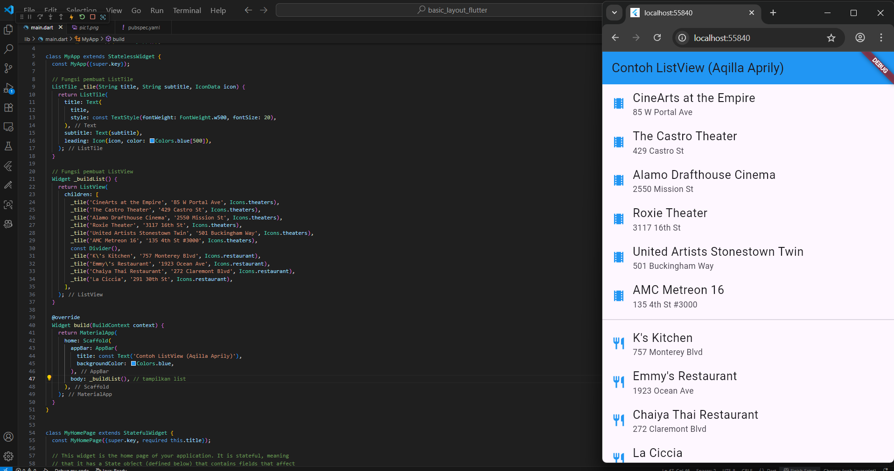

### Hello World Layout
  
This example introduces a fundamental Flutter layout, using a Scaffold and Center widget to display text in the middle of the screen, forming a basic widget tree.

---

### Row Layout
  
This example uses the Row widget to display three images side-by-side, demonstrating how it arranges and aligns children horizontally.

---

### Column Layout
  
This example features the Column widget, which arranges three images in a vertical stack to demonstrate how it manages alignment and spacing from top to bottom.

---

### Row with Expanded Widgets
  
This layout uses the Expanded widget to make images in a Row grow and share the horizontal space equally. This creates a flexible design that automatically adjusts to look good on different screens.

---

### Stack Layout with Overlapping Elements
  
This example introduces the Stack widget, which layers children on top of one another. By overlapping images, with the center one appearing larger, it demonstrates how to create a visual depth effect.

---

### Rating Widget with Stars
  
This example shows how to create a simple star rating. It places five Icon widgets in a Row, styling them to look like a 3 out of 5-star review.

---

### Recipe Information Card
  
A more complex layout combining multiple widgets including stars for ratings, icons for different information categories, and text widgets. This demonstrates how to create information-dense layouts with proper spacing and visual hierarchy using Column and Row combinations.

---

### Pavlova Recipe with Image
  
This layout shows a user-friendly method for presenting item details, placing a prominent image next to its corresponding description. By using a Row, the design creates a clean separation between visual and textual content for an intuitive presentation.

---

### Responsive Pavlova Layout Card
  
This updated version shows how to make a layout that adapts to different screen sizes. On wider screens, it cleverly changes how much space the text and image take up to keep everything looking balanced.

---

### Simple Image Gallery
  
This example starts by building a simple grid of images to create a gallery. It then takes it a step further by adding decorative Containers around each picture, teaching you how to use borders, padding, and color to make each item look like a stylish card.
---

### Grid Gallery
  
This example demonstrates a responsive image gallery using GridView or Wrap. The layout automatically adapts to different screen sizes by wrapping images into new rows when space is limited, showcasing Flutter's built-in responsive capabilities.

---

### ListView with Icons and Text
  
This example shows how to make a list that you can scroll up and down using the ListView widget. Each item in the list is a neat row with an icon and text, perfect for creating organized lists like a directory of restaurants.
---

### Profile with Stack Widget
  
This example demonstrates a key design technique using the Stack widget to achieve a layered effect. By overlapping a circular avatar and text elements, it shows how to construct a modern, centered profile header.

---

### Contact Card with ListTile
  
This last example shows how to make a neat contact card. It uses the Card widget to create the boxy shape and ListTile to organize each piece of contact info with a matching icon, just like you'd see in a phone's contact list.