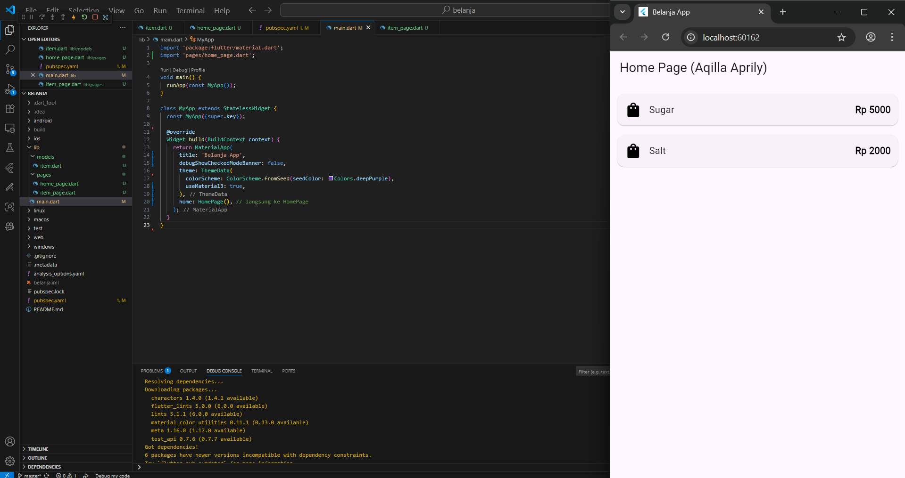
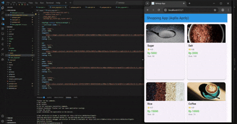

# *Home Page*

### This application's Home Page dynamically generates a shopping list using a **`ListView.builder`** from a custom **`Item`** data model. Each list item, such as Sugar (Rp 5000), is displayed within a tappable **`Card`** that uses **`InkWell`** for a ripple effect and contains an icon, name, and price. Tapping an item triggers navigation via named routes, passing the selected item's data to a separate Item Page. This implementation effectively showcases key Flutter features, including data modeling, dynamic list building, data passing, and the use of Material Design widgets to create an enhanced user experience.

# Practicum Assigment 2  
**Mobile Programming - Navigation and Route**  

### This application features a product catalog displayed in a responsive **`GridView`**, where each item now includes an **image**, **rating**, and **stock** count. Navigation between the list and detail pages is managed by the **`go_router`** package, with data being passed via the **`extra`** parameter. To enhance the user experience, a **Hero animation** provides a seamless visual transition when a product is tapped. The layout is completed with a footer that displays the developer's name and student ID.