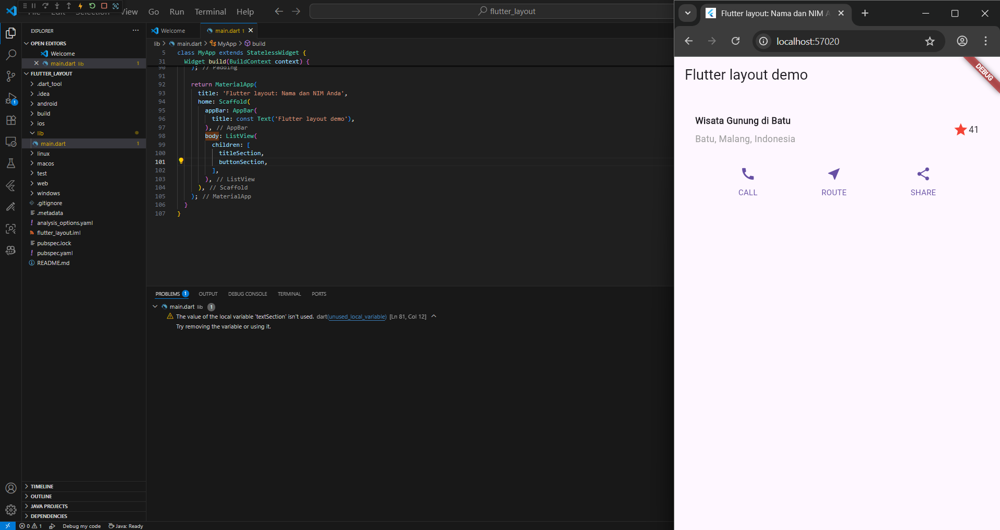

 #  NOTED : 
## PRACTICUM ASSIGMENT 1
https://github.com/Aqillaaprly/https---github.com-Aqillaaprly-Mobile/tree/master/basic_layout_flutter 

## PRACTICUM 5 & PRACTICUM ASSIGMENT 2
https://github.com/Aqillaaprly/https---github.com-Aqillaaprly-Mobile/tree/master/belanja 

 
## Praktikum 1 - 4 :

### This initial stage focuses on building the app's title section. The code on the left defines a titleSection widget that uses a Row for horizontal arrangement. Inside this Row, an Expanded widget holds a Column with the title and subtitle, forcing it to take up all available space. This pushes the star rating icon to the far right, producing the balanced layout seen in the app preview on the right.

### The second stage demonstrates adding the button section and structuring the main page within a Scaffold. The app preview now includes three new buttons below the title. The code reveals that the main layout uses a ListView to stack these components vertically. At this point, the ListView contains the title and button sections, but a warning in the editor indicates that a textSection variable has been created but not yet used, showing this is a work-in-progress.

### In the third stage, the layout is completed by adding the text description section. The app on the right now displays a full page with the title, buttons, and a descriptive paragraph about Mount Bromo. The code confirms this progress by showing that the ListView's children array now includes all three components. Consequently, the previous warning is resolved, as all defined widgets are now implemented in the layout.

### This final image showcases the completed and polished application. A large header image of Mount Bromo has been added to the top of the layout, making it more visually engaging. The code on the left shows this was achieved by placing an Image.asset widget as the first item in the list, using BoxFit.cover to ensure it scales properly. Additionally, the AppBar has been personalized with a name and student ID, which is reflected in both the code and the final app preview, marking the completion of the project.